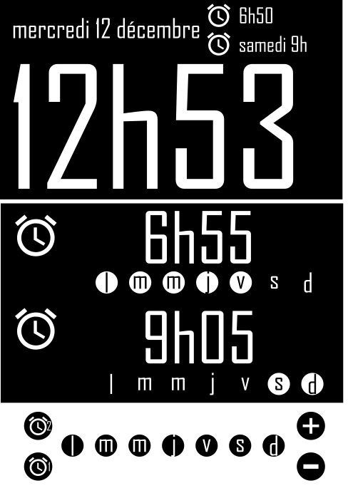
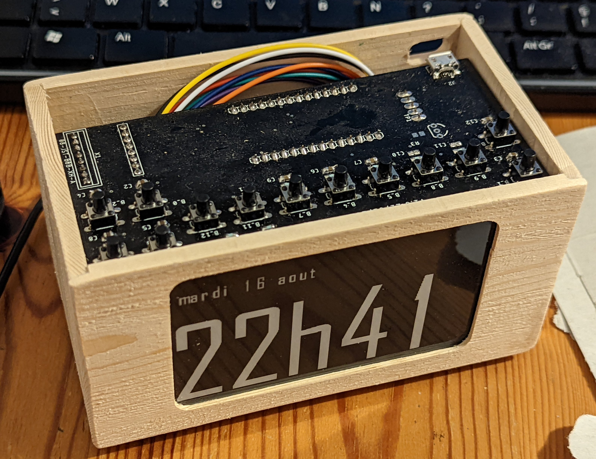

# Alarm clock

## Purpose

The goal of this project is to build a physical alarm clock with same functionalities
that a phone alarm clock:

- configure alarm day by day
- postpone alarm by one day
- deactivate the alarm on public holidays

**Project is still under development**

### Design

This is the initial design drawn on inkscape:



Here is the current result of the box and the screen:




### Hardware

#### MCU

Several constraints on this project:

- access to internet via Wifi
- Digital Analog Converter (DAC) to play music
- several inputs/outputs for the buttons

I chose an Arduino mkr1010 which is a circuit containing a Cortex-M0 SAMD21 and a wifi
chip too. Arduino provides all the environnement to quickly start using the chip.

#### Screen

Screen is an e-ink screen of 3.7 inches from Waveshare: https://www.waveshare.com/product/3.7inch-e-paper.htm.
Waveshare provides a driver for this screen.  
MCU and screen and connected via SPI.

#### Buttons

There are 11 buttons to be connected to the MCU:

- 2 menu buttons to select the alarm and enter clock/setting screen
- 4 buttons to configure the alarm clock
- 7 buttons to select the day of the alarm

The 2 menus buttons and the 4 alarm configuration buttons can be pushed at any time, so they
are connected to interrupt pin of the MCU.  
The 7 buttons to select day of the alarm are active only when configuring the alarm. To minimize
the number of pin used, those buttons are multiplexed to two of the Analog to Digital Converter (ADC)
of the MCU.

I made my own PCB to be able to connect easily all buttons and the screen to the Arduino. Schematic will
be uploaded soon.

#### Speaker

I use a 2W 8ohm speaker with PAM8302A amplifier. Music files are stored on an external SD card.
Sound is produced with the 10 bit DAC of the Arduino board.

### Software

- Arduino provides drivers for SAMD21 and NINA-W102 (Wifi chip)
- Waveshare provides a driver for the screen
- Various libraries are used such as `RTCZero` or `FlashStorage_SAMD` developed by the Arduino community 
This project is mostly focused on the application part.

Application is structured around a Finite State Machine (FSM). There are many ways to implement a FSM, I used
this one: https://www.state-machine.com/doc/PSiCC2.pdf

FreeRTOS is used as the scheduler.

### Build project

#### Dependencies

flash programmer for Atmel SAM microcontrollers `sudo apt install bossa-cli`

#### Build and flash
```
make
make upload
```
